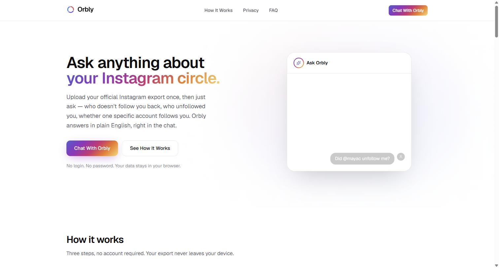

<div align="center">



# Orbly

**Ask anything about your Instagram circle.**

Upload your official Instagram export once, then just ask — who doesn't follow you back, who
unfollowed you, whether one specific account follows you back. Orbly answers in plain English,
in one chat.

[**Try it live →**](https://orbly-drab.vercel.app) · [Privacy](https://orbly-drab.vercel.app/privacy) · [License: MIT](LICENSE) · [How this was built with Claude Code →](docs/CASE_STUDY.md)

</div>

---

## What it does

Orbly is a single chat interface, not a dashboard. Everything runs through conversation:

- **"How many people don't follow me back?"** — counts, rendered as an animated stat card
- **"Show me the first 20"** — a scrollable avatar list with real profile links, with a
  one-click **"mark as unfollowed"** action per row that pulls in the next account, so working
  through the whole list feels like one continuous queue
- **"Does @username follow me back?"** — a single-account lookup
- **"Who unfollowed me recently?"** — detected by comparing two or more imports over time
- **"How do I even get my export?"** — Orbly explains Meta's data-export steps directly in
  conversation, with an expandable visual walkthrough, and a drag-and-drop upload box right in
  the chat
- General Instagram questions Orbly can't answer from your data (story views, who viewed your
  profile, DMs, account verification/category, posting frequency) get an honest "I can't tell you
  that from this data" instead of a guess

There is no login, no password, and no separate onboarding page — the chat itself is the entire
product.

## Architecture

Orbly is local-first with **one deliberate exception**, and is explicit about the difference:

```
Instagram export (ZIP)
        │
        ▼
  browser File API + JSZip (in-memory, client-side)
        │
        ▼
  src/lib/instagram parser  →  IndexedDB (Dexie)
        │
        ▼
  chat tool calls read IndexedDB directly in the browser
        │
        ▼
  ┌─────────────────────────────────────────────┐
  │  ONLY when you ask a question in the chat:   │
  │  the specific facts a tool returns (a count, │
  │  a page of usernames, a yes/no lookup) pass  │
  │  through /api/chat to Claude via the Vercel  │
  │  AI Gateway to generate the reply.           │
  └─────────────────────────────────────────────┘
```

Importing, parsing, browsing your data, and the manual unfollow queue are 100% client-side —
there's no `/api/upload` route and your export file is never transmitted anywhere. The one
exception is the AI chat itself: answering a question about your account sends the relevant tool
result (never the raw export, never your full username lists in bulk) to Anthropic's Claude
through the Vercel AI Gateway. Every chat tool executes **client-side** (no server `execute`
function) specifically so the model only ever receives what it explicitly asks a tool for.

## Tech stack

- **Next.js App Router + TypeScript**, React 19
- **Vercel AI SDK** (`ai`, `@ai-sdk/react`) + **Claude** via the **Vercel AI Gateway**, using
  client-side tool calls (`useChat` + `onToolCall`, no server-side tool execution)
- **Tailwind CSS v4** (CSS-based theme in `src/app/globals.css`)
- **Framer Motion** for animation — message/tool-card entrance, the interactive unfollow queue,
  the animated import-progress checklist
- **Dexie** + `dexie-react-hooks` for IndexedDB persistence and reactive queries
- **JSZip** for in-browser ZIP parsing
- **Zod** for chat tool input schemas and backup-file validation
- **Vitest** + Testing Library for unit tests

No Supabase, Firebase, external database, or auth provider anywhere.

## Getting started

```bash
npm install
npm run dev
```

Open http://localhost:3000. If port 3000 is occupied, Next.js will pick the next free port and
print it in the terminal.

### Environment variables

The chat feature (`/api/chat`) needs access to the Vercel AI Gateway:

- **Deployed on Vercel:** nothing to configure — the Gateway authenticates automatically via
  Vercel's OIDC token. You do need a payment method on file for your Vercel account (Vercel
  requires this before the Gateway will serve any requests, even free-tier credits).
- **Local development:** run `npx vercel env pull .env.local` to pull a working OIDC token, or set
  `AI_GATEWAY_API_KEY` in `.env.local` yourself. Without one, every other page still works — only
  the chat's actual model responses will fail.

Every other feature (import, parsing, all data browsing, the unfollow queue) needs no environment
variables at all.

## Testing

```bash
npm run typecheck   # tsc --noEmit
npm run lint        # eslint
npm test            # vitest run
```

Unit tests cover username normalization (including Meta's "_u/" redirect hrefs and
deleted-account placeholders), relationship set math (mutuals / non-followers), snapshot-to-
snapshot change detection, canonical dataset hashing, and full ZIP parsing against synthetic
fixtures in `tests/fixtures/instagram-export/` — including multiple followers files, nested
directory layouts, decoy files that must never be misclassified (close friends, blocked accounts,
follow requests, recently-unfollowed lists), missing timestamps, and both historical and current
Meta export shapes.

## Instagram export parsing

Code lives in `src/lib/instagram/`:

- `normalize.ts` — username normalization (`@Alex ` → `alex`), validation, and filtering of
  Meta's deleted/deactivated-account placeholders (`__deleted__<hash>`, `deleted<hash>`) so dead
  profile links never surface
- `detect-files.ts` — classifies each archive file as followers / following / ignored, using
  filename patterns first and JSON shape as a secondary signal; explicitly excludes close
  friends, blocked accounts, follow requests, and recently-unfollowed lists even though their
  filenames contain "follow"
- `record-extract.ts` — schema-aware JSON extraction; resolves a username from `value`, falls
  back to `title`, then to the profile `href` (handling both the classic direct-link format and
  Meta's newer `_u/`-redirect format)
- `html-extract.ts` — a regex-based extractor for Meta's legacy HTML export format
- `parser.ts` — opens the ZIP with JSZip, walks every file, classifies it, and extracts
  relationship records regardless of how Meta nests `string_list_data`
- `comparisons.ts` — pure set operations: current relationships (mutuals / one-way) and
  snapshot-to-snapshot changes (new/lost followers, started/stopped following)
- `chat-data.ts` / `chat-tools.ts` — the pure computation and Dexie-backed lookups the AI chat's
  tool calls are built on

The parser never fabricates precision it doesn't have: a lost follower is only ever described as
"detected between snapshot A and snapshot B," never as an exact timestamped event, and a tool
result is only ever presented as fact when it actually came back from the data.

## IndexedDB structure

Database name: `orbly-local` (see `src/lib/db/schema.ts` and `index.ts`).

| Table | Purpose |
|---|---|
| `snapshots` | One row per import: counts, dataset hash, validity, timestamps |
| `snapshotFollowers` | Follower rows for a given snapshot (`snapshotId` indexed) |
| `snapshotFollowing` | Following rows for a given snapshot |
| `queueItems` | Manual unfollow queue: username, source, status (pending/completed/skipped) |
| `settings` | Single-row app settings (onboarding state, motion preference) |

## Snapshot comparison logic

Given followers/following sets `F` and `G` for the current snapshot:

- Mutuals = `F ∩ G`
- Doesn't follow you back = `G - F`
- You don't follow back = `F - G`

Given two snapshots in time:

- New followers = `currentFollowers - previousFollowers`
- Lost followers = `previousFollowers - currentFollowers`
- Started following = `currentFollowing - previousFollowing`
- Stopped following = `previousFollowing - currentFollowing`

`src/hooks/useLostFollowerEvents.ts` walks every consecutive pair of snapshots — not just the two
most recent — so unfollow detection reflects the full import history, and both the chat's
`listRecentUnfollowers` tool and the UI read the same underlying function.

## Known limitations

- Orbly can only see what's in the exports you upload — it cannot retroactively know about
  followers who came and went before your first snapshot.
- Change detection knows the *interval* between two snapshots, never the exact moment a change
  happened.
- The export contains only usernames, profile URLs, and timestamps — no verification status,
  account category, bio, or posting activity, so the chat can't filter or classify by those.
- IndexedDB is per-browser, per-device storage. Clearing site data removes it; use the backup
  export in Settings before doing so.
- Orbly has no live connection to Instagram — it can't detect that you've unfollowed someone
  automatically. The interactive unfollow queue records what you say you've done.

## Disclaimer

Orbly is not affiliated with or endorsed by Instagram or Meta.

## License

[MIT](LICENSE) — use it, modify it, ship it, just keep the copyright notice.
